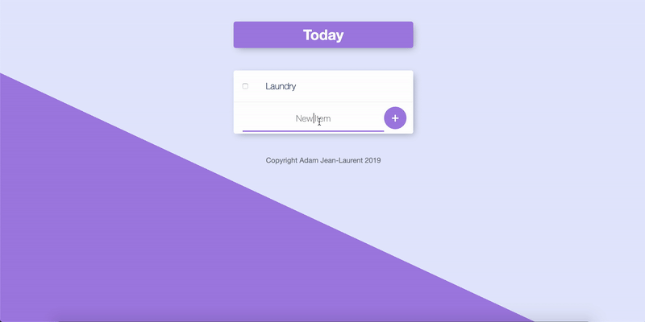

# To Do List With Database
To-Do List web application with a database and dynamic route paramaters

This To-Do-List application allows for dynamic routing, meaning, the user can create any number of different To-Do-Lists at the same time, one for work, one for personal tasks, one for school etc. Simply by adding a /"custom-list-name" after the base URL.
See example in Gif.

## Gif Of Usage

## Installation and Setup Instructions

Clone down this repository. You will need `node` , `npm` and `mongoDB` installed globally on your machine.  

Installation:

`npm i`

To Start Server:

Open A new terminal session and run `mongod`, and run `node app.js` in the project directory.

To Visit App:

`localhost:3000`

## Reflection

- I wanted to build a basic CRUB application, and I thought a To-Do-List would be an exiciting project because it would be an application I can actually use to increase my productivity.
- The stack used is Node.js with Express, MongoDB, EJS, HTML, CSS, Bootstrap, and other NPM packages such as lodash, and mongoose
